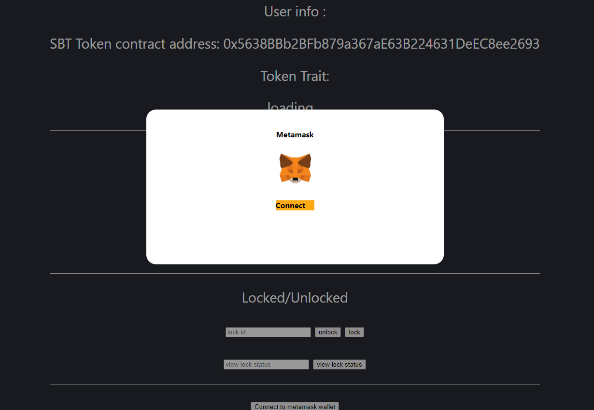
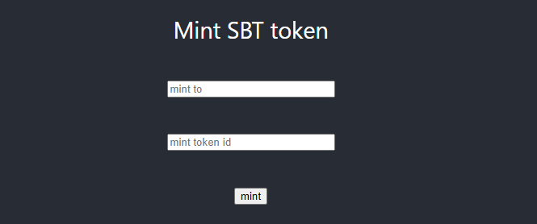
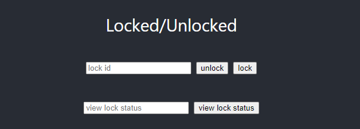
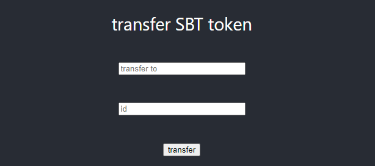
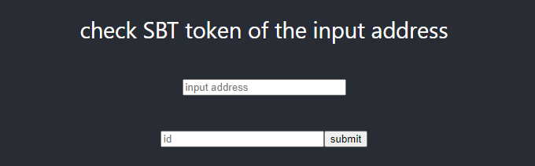

# Soul Bound Token (SBT) Testing Website

This project is to test Soul Bound Token which extends from ERC1155 standards with minting, transferring, locking and unlocking tokens. The admins are allowed to restrict certain tokens from transferring among the users. 

### `npm start`

Runs the app in the development mode.\
Open [http://localhost:3000](http://localhost:3000) to view it in your browser.

### 1, Connect to Metamask wallet

Click `Connect to metamask wallet` to connect the wallet with the website

### 2, Minting (Admin only)
Input the intended address and the token ID. 

### 3, Lock/Unlock (Admin only)
Input the token ID to lock/unlock transferring among users

### 4, Transferring 
To transfer the token, input the intended address and the token ID. 
(The token must be unlocked)

### 5, Balance 
To check the balance of SBT Token a user owns, input the user address and the token ID 

